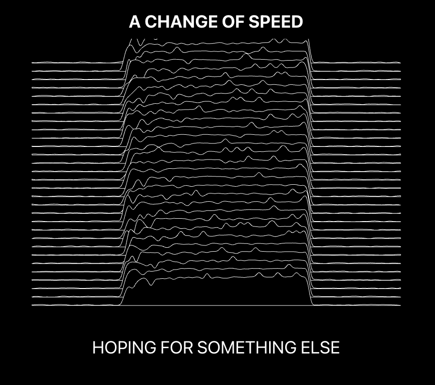

# A Change of Speed

A D3.js exploration recreating the iconic waveform visualization style from Joy Division's Unknown Pleasures album artwork. This project represents my ongoing exploration of the intersection between music, art, and technology - taking inspiration from one of post-punk's most recognizable visual artifacts and reimagining it as an interactive digital experience.

## Features

- Interactive waveform visualization inspired by Peter Saville's pulsar design
- Real-time parameter controls to modify the visualization
- Animation toggle with click or spacebar
- Fully customizable visual parameters through the control panel

## Try It

Click the graph to trigger the animation, or use the control panel to fine-tune the visualization parameters.



## Tech Stack

- Next.js 14
- React
- D3.js for visualization
- TypeScript
- Tailwind CSS

## Run It

```bash
npm install
npm run dev
```

## License

MIT

## Credits

Inspired by the iconic 1979 album artwork created by Peter Saville, showing radio waves from pulsar CP 1919. This visualization reimagines that scientific data-turned-art piece as an interactive digital experience, bridging the gap between music history and modern web technology.
